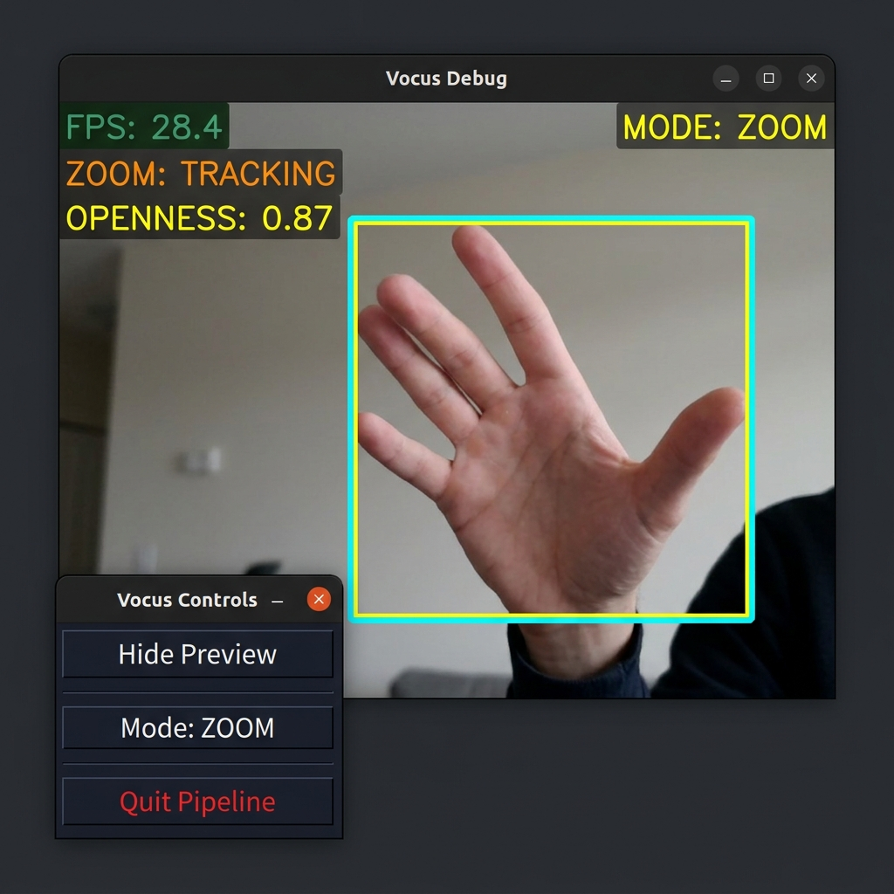
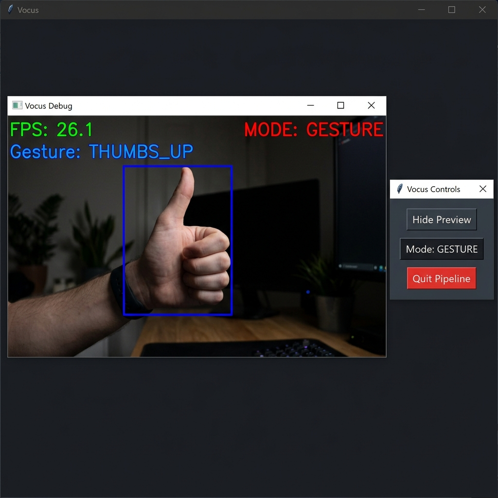

# Vocus


**Camera-only hand interaction for zoom control and gesture-driven scrolling — no GPU, no special hardware, no gloves.**

Vocus maps hand pose to desktop control in real time using a standard webcam. It runs two modes side by side: a geometry-based **Zoom mode** that tracks hand openness to emit `Ctrl+Scroll` zoom events, and a **Gesture mode** that feeds a trained linear SVM into a scroll controller. A small Tkinter panel lets you switch modes and toggle the debug preview without touching the keyboard.

---

## Screenshots

| Zoom Mode | Gesture Mode |
|:---------:|:------------:|
|  |  |

*Left: Zoom mode tracks the hand's openness score (shown as `OPENNESS`) to fire continuous zoom-in / zoom-out events. Right: Gesture mode classifies hand shape into `SCROLL_UP` or `SCROLL_DOWN` using the trained SVM.*

---

## I. Executive Summary

Vocus solves a simple interaction problem: map hand pose to reliable desktop control without requiring gloves, controllers, or a depth camera. The runtime pipeline has two distinct modes:

- **Zoom mode** — Uses MediaPipe hand landmarks and a calibrated openness heuristic to emit smooth, proportional `Ctrl+Scroll` zoom events. An open-palm gesture fires a `Ctrl+0` zoom-reset.
- **Gesture mode** — Feeds a 20-feature normalized landmark-distance vector into a linear SVM classifier trained from locally collected webcam samples. Maps `up` / `down` / `neutral` classes to scroll commands.

Both modes share a producer-consumer architecture: a background vision thread enqueues commands into a bounded queue, and a dedicated controller thread drains the queue and dispatches OS-level input events. A Tkinter control panel runs on the main thread and lets you toggle preview, switch modes, and quit cleanly without needing keyboard access.

The working training set is not bundled in the repository. Samples are captured from the operator's webcam via `src/train_model.py` and serialized into `models/gesture_svm.pkl`.

---

## II. Architecture & Pipeline

```
Webcam frames
    │
    ▼
MediaPipe Hand Landmarker  ──────────────────────────────────────┐
    │                                                             │
    ├─── ZOOM MODE                                               │
    │       Openness score (thumb-to-fingertip distances)        │
    │       EMA smoothing → deadzone → power curve               │
    │       → ZOOM_IN / ZOOM_OUT / RESET_ZOOM command            │
    │                                                             │
    └─── GESTURE MODE                                            │
            Normalized wrist-relative distance vector (20D)      │
            → Linear SVM → majority-vote history buffer          │
            → SCROLL_UP / SCROLL_DOWN / TOGGLE_MODE              │
                                                                 │
Bounded queue (maxsize=1)  ◄─────────────────────────────────────┘
    │
    ▼
ScrollController (background thread)
    Pose-aware rate limiting, separate cooldowns per mode
    → OS scroll / zoom / reset events

Tkinter Control Panel (main thread)
    Toggle preview | Switch mode | Quit
```

The queue cap of 1 ensures the controller always acts on the latest hand pose, not a backlog of stale gestures.

---

## III. Quickstart

```bash
git clone https://github.com/BenniKensei/Vocus.git
cd Vocus

python -m venv .venv
.venv\Scripts\activate          # Windows
# source .venv/bin/activate     # macOS / Linux

pip install -r requirements.txt

python -m src.main
```

The Tkinter control panel opens on startup. By default, the debug preview window is also shown (`config.json → app.preview: true`).

Press **Quit Pipeline** in the panel (or `q` in the preview window) to exit cleanly.

### Headless / demo run

```bash
python demo.py
```

The demo uses seeded synthetic data and prints a deterministic toy accuracy score. It does not require a webcam, MediaPipe, or a trained model — useful for verifying the install without hardware.

### CLI flags

| Flag | Default | Description |
|---|---|---|
| `--device N` | `0` | Camera device index |
| `--width W` | `1280` | Capture width |
| `--height H` | `720` | Capture height |
| `--cooldown S` | from config | Override scroll cooldown (seconds) |
| `--no-preview` | off | Start without the debug preview window |
| `--debug` | off | Force the preview window on at launch |

---

## IV. Dual-Mode Interaction

### Zoom Mode (default)

Hand openness — the mean thumb-to-fingertip distance normalized by palm scale — drives proportional zoom:

| Hand pose | Openness score | Action |
|---|:---:|---|
| Tight fist | < 0.56 | `ZOOM_IN` (continuous) |
| Relaxed / neutral | 0.56 – 1.02 | No action (deadzone) |
| Spread open | > 1.02 | `ZOOM_OUT` (continuous) |
| Open palm, thumb tucked | — | `RESET_ZOOM` (Ctrl+0, latched) |

Zoom magnitude scales with how far the openness exceeds the deadzone, clamped to `[min_magnitude, max_magnitude]` from `config.json`.

### Gesture Mode

The linear SVM maps a 20-element wrist-relative distance vector to one of three classes:

| Label | Class | Action |
|:---:|---|---|
| 0 | `up` | `SCROLL_UP` |
| 1 | `down` | `SCROLL_DOWN` |
| 2 | `neutral` | No action |

A majority-vote buffer of 5 frames stabilizes the output and suppresses single-frame misfires. Predictions require ≥ 80 % agreement across the history window.

### Switching Modes

- Click **Mode: ZOOM / GESTURE** in the Tkinter panel, **or**
- Hold a two-finger swipe gesture (index + middle extended, ring + pinky folded) while moving the hand vertically past the configured `toggle_delta_threshold`.

---

## V. Data Provenance

Training data comes from live webcam captures collected by the operator. It is not bundled in the repository. The training script records normalized landmark-distance vectors directly from MediaPipe hand landmarks.

**Feature schema:**

| Field | Type | Shape | Description |
|---|---|:---:|---|
| `features` | float32 | `(N, 20)` | Normalized wrist-relative distances to each of the 20 non-wrist landmarks |
| `labels` | int64 | `(N,)` | Gesture class: `0 = up`, `1 = down`, `2 = neutral` |

**To collect fresh samples and retrain:**

```bash
python -m src.train_model
```

The collector opens the webcam. Press `u` to label a frame as *up*, `d` for *down*, `n` for *neutral*, and `s` when done. The serialized SVM is written to `models/gesture_svm.pkl`.

---

## VI. Configuration

All runtime parameters live in `config.json` at the project root. Key tuneable values:

```jsonc
{
  "zoom": {
    "fist_threshold": 0.56,       // openness below this = ZOOM_IN
    "neutral_threshold": 1.02,    // openness above this = ZOOM_OUT
    "over_open_threshold": 1.55,  // openness at this = max ZOOM_OUT
    "deadzone_in": 0.18,          // deadzone width on the zoom-in side
    "deadzone_out": 0.24,         // deadzone width on the zoom-out side
    "max_magnitude": 3,           // maximum scroll clicks per event
    "reset_cooldown_sec": 1.0     // minimum gap between Ctrl+0 resets
  },
  "controller": {
    "zoom_cooldown_sec": 0.08,    // repeat rate in zoom mode
    "gesture_repeat_delay_sec": 3.0  // hold-to-repeat delay in gesture mode
  },
  "app": {
    "default_mode": "ZOOM",       // "ZOOM" or "GESTURE"
    "preview": true               // show debug preview window on startup
  }
}
```

---

## VII. Results

| Approach | Metric | Result | Notes |
|---|---|:---:|---|
| Rule-based thresholding | Stability | ⚠ Weak | Dropped too often near neutral poses |
| Linear SVM on collected landmarks | Training accuracy | 1.000 | Sanity-check fit on local capture set |
| Toy nearest-centroid demo | Accuracy | 1.000 | Deterministic synthetic result from `demo.py` |

The project does not yet include a held-out validation split, cross-validation score, or CI-enforced regression tests. Training accuracy on the local capture set is the only automated metric currently available.

---

## VIII. Platform Support

| Platform | Scroll | Zoom (Ctrl+Scroll) | Reset (Ctrl+0) |
|---|:---:|:---:|:---:|
| Windows | ✅ `ctypes` WinAPI | ✅ | ✅ |
| macOS | ✅ Quartz `CGEvent` | ❌ (no-op) | ❌ (no-op) |
| Linux | ✅ `xdotool` | ❌ (no-op) | ❌ (no-op) |

---

## IX. Known Limitations & Trade-offs

- Model generalization depends on the operator's lighting, camera angle, and hand shape — the SVM is fit on locally captured data only.
- Training accuracy on the local capture set is the only built-in metric; no held-out benchmark exists.
- Model serialization uses `pickle`, which is not safe for untrusted artifacts.
- Zoom shortcuts rely on `Ctrl+Scroll` and `Ctrl+0` browser/app support (Windows only for now).
- The pipeline is CPU-bound and intended for lightweight desktop use, not high-throughput video analytics.
- No persistent labeled dataset, automated benchmark suite, or CI-enforced regression tests yet.

---

## X. Reproduction

```bash
# 1. Collect balanced samples (webcam opens automatically)
python -m src.train_model

# 2. Verify the model artifact was written
ls models/gesture_svm.pkl

# 3. Run the full pipeline
python -m src.main

# 4. (Optional) Validate the headless demo path
python demo.py
```
